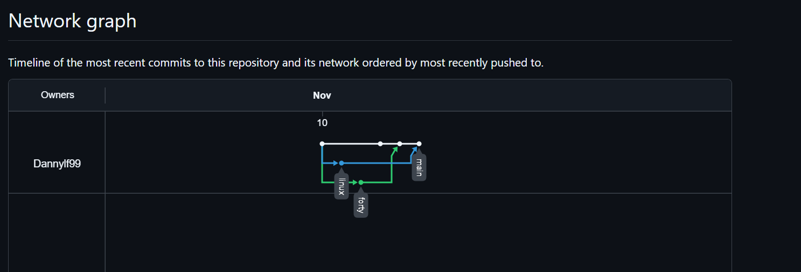

# Daniel López Fernández

## Repositorio Despliegue de Aplicaciones Web

## Contenido:

`00_RepasoLinux` -> Actividades Repaso de Linux

`01_EjercicioGitForty` -> Tarea Git Forty

`README.md` : Descripción del repositorio y, enlace al repositorio.

## URL DEL REPOSITORIO

https://github.com/Dannylf99/repositorioDespliegue/

## Captura del Network Graph

